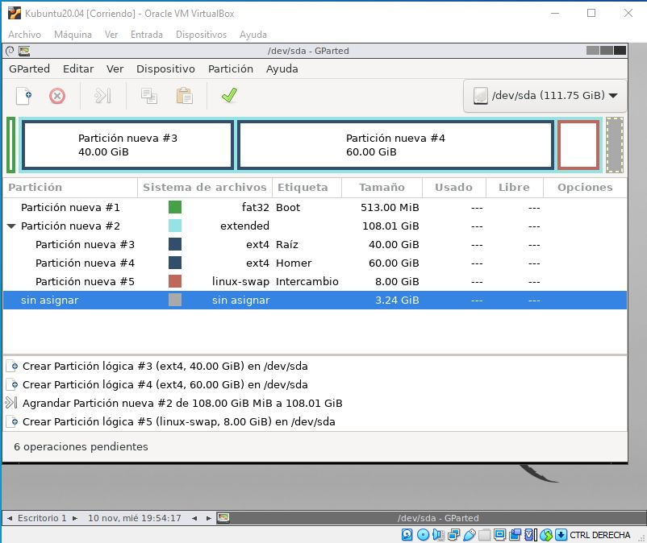

# 2021 Octubre 08

*Conseguí hacer las particiones de la práctica, pero el proble que hay es que se supone que la tengo mal hecha, ya que es las hojas de la práctica a seguir supuestamente detallada (muy mal expresada), no especifíca con detalle los inconvenientes futuros a las hora de acabar el trabajo. Hay que decir los fallos futuros para no hacer perder tiempo en chorradas con video que no vienen al caso e incluso que no son entendibles o inservibles, es decir supuestas ayudas.*

